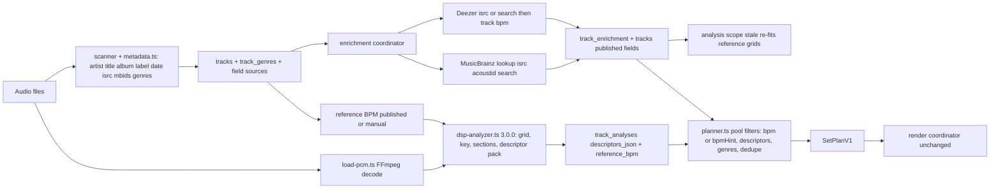

# Handover plan — Crate v3: whole-library analysis, descriptor pack, enrichment, numeric planner filters

Status: ready to start. Builds on `main` at `01c08d7` (Mixing v2.2). Two doc files are modified and uncommitted (`docs/progress.md`, `docs/manual-test-log.md`); commit them first (WP0). Copy this plan verbatim to `docs/plans/crate-v3-handover.md`.

## 0. Context for whoever picks this up

**What exists (v2.2, committed):** DSP analyzer `dnb-crate-dsp` (tempo comb + logistic confidence, reference grids, key v2, sections, silence bounds, descriptors), set planner with section windows and 3-band presets, `analysis:gate`, `plan:clone --replan`, `render:check`. Tests 18 files / 116 passing; `tsc` clean.

**Measured state of the crate (2026-09-03, read-only queries on `data/dnb-crate.sqlite` and file tags):**

- 583 tracks (582 FLAC, 1 MP3), 47.5 h, 87 artists. **14 analyzed**, 569 `not_analyzed`. `bpm_source`: 14 published, 569 NULL. `key_source`: 9 manual, 3 analyzed, 571 NULL. **0** tracks with energy, rating, moods, tags, or subgenres.
- Stored DSP rows (`analyzer_version` 2.1.0 although they contain v2.2 `audioStartMs/audioEndMs`): 5 accepted, 8 rejected, 1 reference. `suggestedEnergy` is 6 or 7 on all 14; `dropIntensity` 0.55–0.67; `subBassRatio` 0.52–0.57; `brightness` 0.06–0.14; `keyConfidence` 0.001–0.03 on every row; `downbeatConfidence` 0.18–0.32.
- Rejected-but-correct raw tempos: Departure 174 (0.28), It Must Be 175 (0.47), Like a Memory 175 (**0.929**, rejected because published 176 and the 176 reference fit failed). 3:2 confusion on 124/125 BPM tracks (raw 186 / 187.5).
- File tags: BPM 0, key 0, MusicBrainz IDs 30 (Drukqs), ISRC 122, label 115, catalog number 63, genre 491 (`Drum & Bass` 255, `Electronic` 117, `Drum n Bass` 33, `Rock`/`Alternative Rock` 40, `IDM`/`Ambient`/`Experimental` ~52), date 582. ~60 duplicate files (Pendulum `Hold Your Colour`, `Immersion`, `In Silico` twice). Artist spellings differ (`Chase & Status` / `Chase And Status`).
- External: MusicBrainz WS/2 = 1 req/s per IP, meaningful `User-Agent` mandatory, **no BPM field**, search ranks remixes above originals. Deezer public API = no auth, `bpm`/`isrc`/`release_date` per track (173.7 for Sub Focus — Tidal Wave), `GET /track/isrc:CODE`. AcousticBrainz frozen at 2022 (not used). Local FFmpeg `N-125875` has the `chromaprint` muxer (AcoustID fingerprints without `fpcalc`).

**Environment notes**

- Windows, Node 24, FFmpeg nightly on PATH. `pnpm` is not on PATH: use `node ./node_modules/vitest/vitest.mjs run`, `node ./node_modules/typescript/bin/tsc --noEmit -p tsconfig.json --pretty false`, `node ./node_modules/tsx/dist/cli.mjs apps/cli/src/main.ts <cmd>`.
- Private crate under a gitignored music folder. `data/`, `output/`, `dnb-crate.config.json`, audio are gitignored. Never commit them; never paste library paths into docs. Do not edit `.cursor/plans/*`. No `tmp-*` scripts left in the tree.
- The local `dnb-crate.config.json` already contains the user's AcoustID key under `enrichment.acoustid.apiKey` and a contact string under `enrichment.contact`. It is a secret: never echo it in output, commits, docs, or the example config. Use `dnb-crate.config.example.json` for shape only (`"apiKey": ""`).
- Reference artifacts to keep: liked plan `0e2b79c6-4b8e-4b49-99f0-53aa1d6f4a56`; `output/renders/hour-mix-old.wav`, `hour-mix-v2.1.wav`, `hour-mix-v2.2.wav`; previews `witchcraft-tidal-wave-bass-swap*.wav`, `coming-down-witchcraft-phrase-mix-v2.2.wav`.

**Ground rules**

- Suite + typecheck green and **one commit per WP**. Fixtures win over the crate. Canonical precedence **manual > published > analyzed > tag** is unchanged; enrichment never overwrites `manual`. Source files are read-only: never write tags to audio files (spec §2.3).
- Tests never touch the network: every HTTP path goes through an injectable `HttpClient`; fixtures are hand-written JSON in MusicBrainz/Deezer/AcoustID response shapes (no copyrighted content).
- Analysis stays advisory. New descriptors are heuristics; say so in docs and in tool descriptions.

## 1. Data flow after this plan



## 2. Work packages and order

- WP0 — Baseline commit, plan file, coverage stats (0.5 h)
- WP1 — Analysis scopes (unanalyzed / stale / all), pipelined jobs, grid policy fixes, `bpmHint` (3 h)
- WP2 — Descriptor pack on the DSP path; analyzer 3.0.0 (5 h)
- WP3 — Enrichment: file tags, MusicBrainz, Deezer, optional AcoustID; migration 008 (6 h)
- WP4 — Planner: numeric descriptor filters, mood presets, genre filters, dedupe, canonical artists (4 h)
- WP5 — Whole-library run, calibration, hour mixes from the entire crate, docs (3 h + ~1.5 h machine time)

Dependencies: WP0 → WP1 → WP2 → WP4; WP3 needs WP0 (and WP1 for the stale scope); WP4 dedupe/genre parts read WP3's tables (build against the migration). Two agents: A takes WP1, WP2, WP4; B takes WP3. WP5 last.

## 3. WP0 — Baseline and coverage harness

**Files:** `docs/plans/crate-v3-handover.md`, [packages/catalog/src/service.ts](packages/catalog/src/service.ts) (`getLibraryStats`), [packages/domain/src/contracts.ts](packages/domain/src/contracts.ts) (`libraryStatsSchema`), [apps/cli/src/main.ts](apps/cli/src/main.ts), `docs/progress.md`.

- Commit the two pending doc files: `docs: log v2.2 ear check`. Add this plan.
- Extend `get_library_stats` / `library:stats` with `analysisCoverage` (`byEngineVersion`, `accepted`, `rejected`, `reference`, `bpmHintOnly` after WP1, `notAnalyzed`) and `metadataCoverage` (counts of tracks with bpm by source, key by source, energy, moods, genres, isrc, label, releaseDate, recordingMbid, `duplicateGroups`). Enrichment fields report 0 until WP3.
- Record the §0 numbers under a dated `## Crate v3 — baseline` heading in `docs/progress.md`. Commit: `chore: library coverage stats and crate v3 plan`.

Acceptance: `library:stats` prints `analyzed 14 / 583` and `energy 0`, matching §0.

## 4. WP1 — Analysis scopes, pipelining, grid policy, bpmHint

**Problem:** `startTrackAnalysis` accepts only explicit ids or `planningReadyOnly` ([packages/catalog/src/service.ts](packages/catalog/src/service.ts) 262–290); jobs run one track at a time with decode, DSP and `ebur128` serialized ([packages/catalog/src/analysis/coordinator.ts](packages/catalog/src/analysis/coordinator.ts) 153–250); a rejected grid means `tracks.bpm` stays null, so the track is invisible to the planner; the fold only tries ×2/÷2.

**Files:** `service.ts`, `coordinator.ts`, [packages/catalog/src/analysis-repository.ts](packages/catalog/src/analysis-repository.ts), [packages/domain/src/analysis-contracts.ts](packages/domain/src/analysis-contracts.ts) (`startTrackAnalysisInputSchema`), [packages/domain/src/tempo.ts](packages/domain/src/tempo.ts), [packages/audio-analysis/src/dsp-analyzer.ts](packages/audio-analysis/src/dsp-analyzer.ts) (`analyze` 862–1032), [packages/domain/src/constants.ts](packages/domain/src/constants.ts), [packages/catalog/src/planning/timeline.ts](packages/catalog/src/planning/timeline.ts) (`TimelineAnalysis`), `apps/cli/src/main.ts`, `apps/mcp-server/src/create-server.ts`, tests, `docs/analysis.md`.

Design

- `start_track_analysis` input gains `scope: "ids" | "planningReady" | "unanalyzed" | "stale" | "all"` (default `ids`; keep `trackIds` / `planningReadyOnly` working). `stale` = no DSP row, or `analyzer_version < DSP_ANALYZER_VERSION`, or `analysis_status = failed`, or (after WP3) `track_analyses.reference_bpm` differs from the current published/manual canonical BPM. Cap a single job at the whole catalog; `waitForJob` takes `timeoutMs` (CLI default 90 min for `--wait`).
- Migration `008_crate_v3` (shared with WP3) adds `track_analyses.reference_bpm REAL` (the reference passed to the analyzer, null when none).
- Pipelining inside `execute`: decode track *i+1* (`loadPcmForAnalysis`) while DSP runs on *i*; run `ebur128` concurrently with decode (`Promise.all`). Config `analysis.prefetch` (default 1). Progress message carries the current title. Log one line per 25 tracks. Stopped jobs stay `failed`/retryable and are picked up by `scope: "stale"`.
- Tempo fold: after the free estimate, if the ×2/÷2 fold fails or is rejected, score the ×2/3 and ×3/2 candidates with `scoreReferenceTempo` and adopt the best one that lands in range and clears the logistic; otherwise keep `bpmRaw` unfolded in the row with reason `"No plausible DnB tempo (…)"`. Never accept a candidate below `MIN_ANALYSIS_CONFIDENCE`.
- Published disagreement tolerance: replace the fixed `> 0.5` in `analyze` (line ~898) with `PUBLISHED_BPM_TOLERANCE = 1.0` when the reference is an integer, `0.5` otherwise. When the free grid clears the logistic within tolerance, keep the free grid (`gridSource: "analyzed"`); canonical BPM stays the published value.
- `bpmHint`: `AnalysisRepository.toView` and `analysisToTimeline` expose `bpmHint = fold(bpmRaw)` and `bpmHintConfidence` when the grid is rejected but `bpmRaw` folds into 160–190 and `bpmConfidence >= MIN_BPM_HINT_CONFIDENCE` (`0.3`). Hints are used only for pool BPM filters, BPM compatibility at half weight, and `get_planning_readiness` (`bpmSource: "hint"`); never for tempo matching or aligned templates. `tracks.bpm` is not written from hints.
- CLI `analysis:run --scope stale|unanalyzed|all [--wait] [--timeout-min N]`; `analysis:start` unchanged.

Tests: scope selection on a temp catalog (unanalyzed vs stale by version vs stale by reference); 124-BPM fixture (kick + off-beat hats built from `synthetic-dnb.ts` primitives) whose free estimate lands at 186 → reported `bpmRaw` 124 class, grid rejected as out of DnB range, no 186 accept; published 176 vs free 175 fixture at high confidence → grid accepted `analyzed`, canonical still 176; `bpmHint` present on a rejected in-range fixture and absent below 0.3; pipelined job completes with the same rows as sequential (fake runner).

Acceptance: `analysis:run --scope unanalyzed` over a 20-track temp catalog finishes with one job; `analysis:gate` accepted in-range does not drop below 5/9 and Like a Memory is no longer rejected for the 175/176 disagreement.

## 5. WP2 — Descriptor pack on the DSP path

**Problem:** `suggestedEnergy` is 6–7 on everything; no danceability / acousticness / melodicness / valence; `shortTermLufs*` never populated.

**Files:** `dsp-analyzer.ts` (descriptor block 977–1029, bar loop 956–970, `onsetStrength`, `estimateKeyFromChroma` call), [packages/audio-analysis/src/chroma.ts](packages/audio-analysis/src/chroma.ts) (expose per-frame chroma stats and a major-vs-minor margin), new `packages/audio-analysis/src/descriptors.ts`, [packages/domain/src/analysis.ts](packages/domain/src/analysis.ts) (`SonicDescriptors`), `analysis-contracts.ts` (`sonicDescriptorsSchema`), `constants.ts` (`DSP_ANALYZER_VERSION` → `3.0.0`), [packages/audio-analysis/src/synthetic-dnb.ts](packages/audio-analysis/src/synthetic-dnb.ts) (new fixtures), tests, `docs/analysis.md`, `docs/decisions.md`.

Design — all computed in the existing single `analyze` pass from `stft.mag`, `onset`, `subEnergy`, `highEnergy`, bar features and chroma; no extra decode, no new runtime. Every value is 0–1, deterministic per file, stored in `descriptors_json` (JSON column, no migration), nullable in Zod so old rows still parse.

- `energy` (continuous, replaces the int formula): `0.4·loud + 0.3·dropIntensity + 0.3·onsetDensityNorm`, where `loud` maps the file RMS in dBFS from −24…−8 to 0…1 (`integratedLufs` is filled later by the coordinator, so use RMS here and keep `integratedLufs` alongside). `suggestedEnergy = round(1 + 9·energy)` for backward compatibility.
- `danceability`: Essentia-style DFA on the 10 ms frame-stddev envelope (tau 310–8800 ms, multiplier 1.1; see the Essentia `Danceability` source), mapped to 0–1, blended with pulse clarity: `0.5·dfaTerm + 0.3·tempoEvidence.prominence + 0.2·tempoEvidence.stability` (0 when no tempo evidence).
- `acousticness`: `0.35·(1 − clamp(subBassRatio/0.6)) + 0.25·(1 − clamp(onsetDensity/0.4)) + 0.25·tonalPeakRatio + 0.15·clamp((dynamicRange − 8)/10)`, where `tonalPeakRatio` = energy in spectral peaks / total in 165–3520 Hz (from `chroma.ts` peak picking).
- `melodicness`: `0.4·chromaClarity + 0.3·tonalStability + 0.3·tonalPeakRatio`; `chromaClarity = 1 − H(meanChroma)/ln 12`; `tonalStability` = mean cosine similarity of consecutive L1-normalized chroma frames over frames above the 20 % energy floor.
- `valence` (documented as low-confidence): `0.35·majorness + 0.25·clamp(brightness/0.15) + 0.2·melodicness + 0.2·danceability`, with `majorness` the KK+Temperley major-vs-minor margin mapped to 0–1 (expose `modeConfidence` from `estimateKeyFromChroma`).
- Also fill `shortTermLufsMean` / `shortTermLufsMax` from 3 s RMS windows (dBFS proxy) or delete the fields; do not leave them permanently null.
- Constants for the reference ranges live in `descriptors.ts` with a dated comment; WP5 re-tunes them once on the 583-track run so the crate spans roughly 0.1–0.9 per descriptor.

Tests (`dsp-analyzer.test.ts` plus new `descriptors.test.ts`)

- New fixtures: `buildPadOnlyPcm({ key })` (sustained triads, no drums), `buildDrumsOnlyDnbPcm()` (synthetic DnB without pad/sub melody).
- Synthetic DnB: `danceability ≥ 0.7`, `acousticness ≤ 0.3`, `energy ≥ 0.6`. Pad-only: `acousticness ≥ 0.6`, `danceability ≤ 0.35`, `energy ≤ 0.4`. White noise: `melodicness ≤ 0.15`, `danceability ≤ 0.3`. Keyed DnB (F#m pad) `melodicness` exceeds drums-only by ≥ 0.2. C-major pad `valence` exceeds F#m pad by ≥ 0.15. All values in [0, 1]; determinism: two runs on the same PCM are identical; `suggestedEnergy = round(1 + 9·energy)`.

Acceptance: fixtures pass; `get_track_analysis` and `compare_track_analyses` show the five fields; `analyzer_version` `3.0.0` on new rows; `scope: "stale"` selects every 2.1.0 row.

## 6. WP3 — Enrichment: file tags, MusicBrainz, Deezer, optional AcoustID

**Problem:** the scanner keeps only artist/title/album; nothing external exists (repo-wide search for musicbrainz/acoustid/isrc/enrich = 0 hits, no HTTP client).

**Files:** new `packages/catalog/src/enrichment/` (`http-client.ts` with fetch + fake, `rate-limiter.ts`, `response-cache.ts`, `musicbrainz.ts`, `deezer.ts`, `acoustid.ts` incl. `ffmpeg -f chromaprint -fp_format 2`, `matcher.ts`, `coordinator.ts`), new `enrichment-repository.ts`, new `packages/catalog/src/migrations/008_crate_v3.ts`, [packages/catalog/src/metadata.ts](packages/catalog/src/metadata.ts), [packages/catalog/src/repository.ts](packages/catalog/src/repository.ts) (`updateScanFields` 690–739, public track mapping), [packages/domain/src/track.ts](packages/domain/src/track.ts), `contracts.ts` (`publicTrackSchema`, `updateTrackMetadataInputSchema`), new `packages/domain/src/enrichment-contracts.ts`, [packages/domain/src/config.ts](packages/domain/src/config.ts), `load-config.ts`, `.env.example`, `dnb-crate.config.example.json`, `apps/cli/src/main.ts`, `apps/mcp-server/src/create-server.ts`, tests, docs.

Design — storage and provenance

- Migration 008 (additive, safe on the live DB): `ALTER TABLE tracks ADD` `label TEXT`, `release_date TEXT`, `isrc TEXT`, `recording_mbid TEXT`, `artist_canonical TEXT`, `recording_key TEXT`, `field_sources_json TEXT` (map field → `tag` | `published` | `manual`); new `track_genres (track_id, genre, source)`; new `track_enrichment` (track_id PK, release_mbid, release_group_mbid, artist_mbids_json, catalog_number, original_date, deezer_track_id, deezer_bpm, deezer_gain, acoustid_id, match_method `file-tags|isrc|acoustid|search`, match_score, matched_at, raw_json); new `enrichment_jobs` (same shape as `analysis_jobs`); plus `track_analyses.reference_bpm` (WP1).
- `metadata.ts` extracts `label`, `date`/`originaldate`, `isrc`, `musicbrainz_recordingid/albumid/artistid/releasegroupid`, `genre[]`, `catalognumber`, `albumartist`. Scan writes tag-sourced fields only where the field source is null or `tag`; `album` follows the same rule (today it is always overwritten). `update_track_metadata` gains `album`, `label`, `releaseDate`, `isrc`, `genres` → source `manual`. Public track exposes `label`, `releaseDate`, `year`, `isrc`, `genres`, `recordingMbid`, `artistCanonical`, `fieldSources`.
- Genre normalization in domain (`genres.ts`): lowercase, alias map (`drum & bass`, `drum n bass`, `drum'n'bass`, `dnb` → `drum and bass`; `liquid drum and bass`, `liquid` → `liquid funk`; `jungle`, `neurofunk`, `jump up`, `techstep`, `idm`, `ambient`, `rock`, `house`, `techno`, `breakbeat`, `electronic`). MusicBrainz `genres` and `tags` (count ≥ 2) are merged as `published`; file genres as `tag`.
- `recording_key` = `recording_mbid` ?? `isrc` ?? `norm(artist)|norm(title)|round(durationMs/2000)`; `artist_canonical` = MusicBrainz artist-credit name when matched, else `norm(artist)`.

Design — matching (`matcher.ts`, deterministic, pure)

- Normalize titles: strip `(feat. …)`, unify `&`/`and`, keep remix/edit/VIP tokens as a required-match set (a remix never matches an original and vice versa). Artist similarity = token Jaccard over artist credit names ≥ 0.6. Duration within ±3 s (MusicBrainz `length`, Deezer `duration`). Score = 0.5·title + 0.3·artist + 0.2·duration; accept ≥ 0.85; 0.6–0.85 → `needsReview` (stored in `raw_json`, no track fields written); prefer `status: Official`.
- Tiers per track, stop at the first accepted match: (1) file `MUSICBRAINZ_TRACKID` → `/recording/{mbid}?inc=artist-credits+isrcs+releases+release-groups+genres+tags&fmt=json`; (2) file ISRC → `/isrc/{isrc}?inc=…`; (3) AcoustID when `enrichment.acoustid.apiKey` is set → fingerprint via FFmpeg chromaprint, `GET https://api.acoustid.org/v2/lookup?client=KEY&meta=recordings+releasegroups+compress&duration=D&fingerprint=FP`, accept results with score ≥ 0.85 then verify with the matcher; (4) `/recording?query=recording:"t" AND artist:"a" AND dur:[ms-4000 TO ms+4000]&fmt=json&limit=10` → matcher. Label and catalog number come from one `/release/{mbid}?inc=labels+release-groups&fmt=json` lookup, cached per release. Release date = release-group `first-release-date`, fallback release `date`.
- Deezer: `GET /track/isrc:{ISRC}` when an ISRC is known (file, MusicBrainz, or Deezer search), else `GET /search/track?q=artist:"a" track:"t"` → matcher on title/artist/duration → `GET /track/{id}` for `bpm`, `gain`, `release_date`, `isrc`. If MusicBrainz found no ISRC, the Deezer ISRC feeds a second MusicBrainz ISRC lookup.
- Published BPM policy (`docs/decisions.md`): write `tracks.bpm` with `bpmSource: "published"` only when the track has no `manual`/`published` BPM and Deezer `bpm > 0`. Fold ×2/÷2 into 160–190 when the track's genres say drum and bass; round to the nearest integer when within 0.3 (173.7 → 174), otherwise keep the decimal. If the track has an accepted DSP grid and the folded Deezer value differs from it by more than 1.0 BPM, do not write; record `bpmDisagreement` in the enrichment report. Writing a published BPM makes the analysis stale (`reference_bpm` mismatch) so WP1's `scope: "stale"` re-fits a reference grid.
- Networking: `HttpClient` interface (real = Node `fetch`, injected fake in tests); per-host token-bucket rate limits (MusicBrainz 1/s, Deezer 5/s, AcoustID 3/s); `User-Agent: dnb-crate-mcp/<APP_VERSION> ( <enrichment.contact> )`; 503/429 honour `Retry-After` (max 3 retries); 20 s timeout; on-disk response cache under `<outputRoot>/cache/enrichment/<sha256(url)>.json` so re-runs are free; failures never throw past the track (marked failed, retryable).
- Config (`enrichment` block, default `enabled: false` in the example; local config turns it on): `enabled`, `contact`, `musicbrainz.enabled`, `deezer.enabled`, `acoustid.apiKey`, `writePublishedBpm` (default true). Env overlays in `load-config.ts`: `DNB_CRATE_ACOUSTID_API_KEY` (wins over the file) and `DNB_CRATE_ENRICHMENT_CONTACT`. **The user's key is already present in the local `dnb-crate.config.json` under `enrichment.acoustid.apiKey`** (today's `z.object` schema strips the unknown block, so it is inert until this WP adds the schema); do not move or print it. Secrets hygiene: the key and contact never appear in logs, tool results, `get_server_status`, reports, cache file names, or docs; `get_server_status` only reports `enrichment: { enabled, musicbrainz, deezer, acoustidConfigured: boolean }`. Redact `client=` query params in any logged URL.
- Surface: MCP `start_metadata_enrichment { scope: "unmatched" | "all" | "ids", trackIds?, dryRun? }`, `get_enrichment_status`, `get_enrichment_report` (matched by method, unmatched, needsReview, bpm written, bpmDisagreements, duplicate groups). CLI `enrich:run --scope unmatched [--dry-run] [--limit N] [--wait]`, `enrich:status`, `enrich:report`. `dryRun` performs lookups and prints what would change without writing.

Tests (`packages/catalog/test/enrichment.test.ts`, fake `HttpClient` + fake process runner)

- MBID lookup path writes label/date/isrc/genres with source `published`; manual `album`/`label` untouched; tag values kept when no match.
- ISRC path picks the recording whose duration matches; search path ranks the original above a remix decoy that MusicBrainz scores higher; below-threshold candidates land in `needsReview` and write nothing.
- Deezer: 173.7 → 174 published; 87 folds to 174 for a drum-and-bass track; 0 bpm ignored; disagreement > 1 BPM with an accepted DSP grid is reported, not written; existing manual BPM never overwritten.
- Rate limiter spacing with a fake clock; `Retry-After` honoured; cache hit performs zero requests on the second run; AcoustID tier skipped without a key and used with one (fake fingerprint runner output).
- Scan after enrichment does not downgrade `published` fields to `tag`; `recording_key` identical for two files of the same recording.

Acceptance: `enrich:run --dry-run --limit 20` on the crate prints per-track method/score and, because the AcoustID key is configured, at least one track resolves via `acoustid` (pick 20 tracks without MBIDs or ISRCs, e.g. the Technimatic albums); full run afterwards matches ≥ 80 % of the crate (report), writes published BPM on the matched DnB tracks, and `library:stats` shows `duplicateGroups` ≥ 20.

## 7. WP4 — Planner: numeric filters, mood presets, genres, dedupe

**Problem:** `create_set_plan` has no descriptor filters; `preferredMoods` is exact-string overlap on empty `moods`; energy for the arc comes from an int that is 6–7 everywhere; duplicates and artist spellings are invisible.

**Files:** [packages/catalog/src/planning/planner.ts](packages/catalog/src/planning/planner.ts) (pool filter 64–94, `scoreFor`), [packages/domain/src/compatibility.ts](packages/domain/src/compatibility.ts) (`scoreCandidate`), [packages/domain/src/planning.ts](packages/domain/src/planning.ts) (`CreateSetPlanInput`), `contracts.ts` (`createSetPlanInputSchema` 375–412, `searchTracksInputSchema` 8–66, `findCompatibleTracks`), new `packages/domain/src/mood-presets.ts`, `repository.ts` (search `json_extract` block 486–509), [packages/catalog/src/planning/validate.ts](packages/catalog/src/planning/validate.ts) (arc check 132–154), `timeline.ts` (`TimelineAnalysis`), `service.ts` (`createSetPlan`, `findCompatibleTracks`), `create-server.ts` (`build-dnb-set` prompt), tests, `docs/scoring.md`, `docs/tool-contracts.md`.

Design

- New optional `descriptors` object on `create_set_plan`, `find_compatible_tracks`, and `search_tracks`: `{ energy?, danceability?, valence?, acousticness?, melodicness?, subBass?, brightness? }`, each `{ min?, max? }` in 0–1. Hard filter on the planner pool; `search_tracks` implements it with `json_extract` like `subBassMin` (existing flat fields stay as aliases). Tracks without a DSP row fail any descriptor filter (`rejected: NO_ANALYSIS`); a manual `energy` 1–10 maps to `(e − 1)/9` for the energy filter when no analysis exists.
- Effective energy everywhere = `track.energy ?? round(1 + 9·descriptors.energy)`; scoring, `requestedArc` interpolation and `validate.ts` arc deviation all use it (removes the scoring/validation inconsistency). Suggested-only energy keeps the ×0.6 weight.
- `mood-presets.ts`: a fixed table mapping brief words to descriptor ranges, e.g. `uplifting` → valence ≥ 0.6 and danceability ≥ 0.6; `dark` → valence ≤ 0.4 and brightness ≤ 0.1; `liquid`/`soulful` → melodicness ≥ 0.55, energy 0.35–0.7; `peak-time`/`heavy` → energy ≥ 0.7, subBass ≥ 0.5; `rolling`/`deep` → danceability ≥ 0.6, brightness ≤ 0.12; `neuro` → energy ≥ 0.75, brightness ≥ 0.12. `preferredMoods` still matches manual `moods` exactly; when a track has no manual moods the mood component is the fraction of preferred moods whose preset the track satisfies (partial credit by normalized distance). `explanation` names which route scored.
- `genres: { include?: string[], exclude?: string[] }` hard filter on `create_set_plan` and `search_tracks` (normalized labels); `preferredSubgenres` also match normalized `genres` at half weight when manual `subgenres` are empty.
- Dedupe: never two entries with the same `recording_key` (`rejected: DUPLICATE_RECORDING`); `artistKey` prefers `artist_canonical`.
- `bpmHint` (WP1) satisfies `bpmMin/bpmMax` and scores BPM at half weight with reason `BPM_HINT_ONLY`; `missingMetadata` still applies for null key/energy.
- `get_library_stats` adds p10/p50/p90 per descriptor so thresholds can be chosen; the `build-dnb-set` prompt explains both routes (`preferredMoods` words or explicit `descriptors`).
- CLI `plan:create` gains `--brief-json FILE` (full `createSetPlanInput`) so hours can be built with filters from the terminal.

Tests (`planning.test.ts`): descriptor hard filters and rejection reasons; mood preset scoring changes the pick when manual moods are empty and is ignored when they are set; arc validation uses descriptor energy; duplicate recordings never co-occur; `Chase & Status` / `Chase And Status` count as one artist for spacing; genre exclude removes IDM fixtures; `bpmHint` track is eligible for crossfade joins only; determinism with the same seed.

Acceptance: a plan with `descriptors.energy.min = 0.7` on a fixture catalog contains only tracks above 0.7; `docs/scoring.md` lists every weight including `structure`.

## 8. WP5 — Whole-library run, calibration, hour mixes, docs

Steps

1. `analysis:run --scope stale --wait --timeout-min 90` over the 583 tracks (analyzer 3.0.0). Record runtime, accepted/rejected/hint counts, descriptor p10/p50/p90 in `docs/progress.md`. Re-tune the WP2 reference ranges once if a descriptor's crate spread is narrower than 0.3; commit the constants with the date.
2. `enrich:run --scope unmatched --wait` (MusicBrainz at 1 req/s ≈ 15–25 min; Deezer; AcoustID is configured, so the fingerprint tier runs for every track that tiers 1–2 miss; fingerprinting adds roughly 1–2 s per track of FFmpeg time). Record match counts by method, unmatched titles count, published BPM written, `bpmDisagreements`, duplicate groups.
3. `analysis:run --scope stale` again so tracks that gained a published BPM get reference grids; then `analysis:gate` (now hundreds of labelled rows) and `tools/scripts/calibrate-confidence.mts --config dnb-crate.config.json`. Adopt new weights / `MIN_ANALYSIS_CONFIDENCE` only if fixtures stay green and accepted-correct does not drop; log the decision.
4. Build two hours from the whole crate with `plan:create --brief-json`: `Liquid hour v3` (genres exclude idm/ambient/rock; melodicness ≥ 0.55; energy 0.35–0.7; arc 4 → 7 → 5) and `Peak hour v3` (energy ≥ 0.7, danceability ≥ 0.6, arc 6 → 9 → 7). Each must use ≥ 10 tracks outside the original 14 and ≥ 6 distinct canonical artists. `render:start --wait`, `render:check` exit 0, copy to `output/renders/hour-liquid-v3.wav` and `hour-peak-v3.wav` (never overwrite older renders).
5. Docs: `docs/progress.md` (dated `Crate v3` heading with WP-by-WP numbers), `docs/analysis.md` (scopes, 2/3–3/2 fold, tolerance, bpmHint, descriptor pack formulas and their heuristic status), `docs/decisions.md` (network opt-in and privacy, Deezer BPM policy, matcher thresholds, no file retagging, descriptor heuristics), `docs/tool-contracts.md` and README tool table (33 tools), `docs/scoring.md`, `docs/manual-test-log.md` rows for both hours (user fills the ear-check verdicts).

Acceptance (whole plan): `library:stats` shows ≥ 95 % of tracks analyzed at 3.0.0, ≥ 80 % enriched, energy spread p10–p90 ≥ 0.3; both hours render with `render:check` exit 0 and draw on tracks beyond the original 14; suite + `tsc` green; one commit per WP; tree clean.

## 9. Verification checklist per WP

```
node ./node_modules/vitest/vitest.mjs run
node ./node_modules/typescript/bin/tsc --noEmit -p tsconfig.json --pretty false
node ./node_modules/tsx/dist/cli.mjs apps/cli/src/main.ts library:stats
node ./node_modules/tsx/dist/cli.mjs apps/cli/src/main.ts analysis:run --scope stale --wait
node ./node_modules/tsx/dist/cli.mjs apps/cli/src/main.ts enrich:run --scope unmatched --dry-run --limit 20
node ./node_modules/tsx/dist/cli.mjs apps/cli/src/main.ts analysis:gate
git status --short
```

## 10. Deferred (not in this plan)

- Sections v3 on real audio (Witchcraft's 140-bar "build"), downbeat confidence calibration so bar-mode alignment triggers on real tracks, key-confidence calibration (0.001–0.03 today) so analyzed keys can become canonical.
- Vocal presence descriptor (vocal-clash avoidance), crate-relative percentile ranks as first-class fields, ML mood models via the Python sidecar, AcousticBrainz dump import, Discogs styles.
- Transition feedback store and preference-aware ranking (spec Stage 5), `double_drop`.

## 11. Risks

- MusicBrainz returns 503 "server busy" under load (observed during planning); backoff with `Retry-After` and the on-disk cache keep a 583-track run resumable. Search false positives are the main data risk: the remix-decoy fixture and the 0.85 threshold guard it; `needsReview` never writes.
- Deezer BPM can be half-time or 0; the fold/round/disagreement rules and `bpmDisagreements` in the report contain it. Published values still never replace `manual`.
- Heuristic descriptors may cluster on real audio like `suggestedEnergy` did; WP5 measures the spread and re-tunes reference ranges once, with fixtures as the floor.
- Long jobs run synchronous DSP on the MCP process's event loop in ~1–2 s chunks; run whole-library jobs from the CLI, and keep MCP jobs scoped.
- Migration 008 is additive on a live DB; back up `data/dnb-crate.sqlite` before the first run (copy, not committed).
- Non-DnB material (IDM, ambient, rock) will mostly end with rejected grids; that is expected and is why genre filters and `bpmHint` exist. Do not tune the DSP against those tracks.