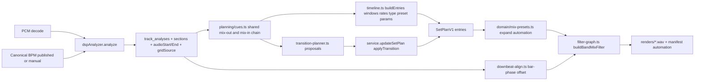

# Handover plan — Mixing v2.2: make the mixes consume the analysis

Status: ready to start. Builds on `main` at `ed58f94` (analysis v2.1). Two doc files are modified and uncommitted (`docs/progress.md`, `docs/manual-test-log.md`); commit them first (WP0).

## 0. Context for whoever picks this up

**What exists (v2.1, committed):** tempo-matched planner, comb-locked sub-hop beats, output-time alignment, key v2, logistic confidence (MIN 0.6), sections v2, cue provenance, `analysis:gate`, sidecar hardening. Tests: 17 files / 90 passing; `tsc` clean. Full review is in the chat that produced this plan; the short version:

**Where it falls short (2026-09-03 review + user listening test of the rebuilt hour):**

1. The set plan never uses sections. `defaultPlayableWindow` in [packages/catalog/src/planning/timeline.ts](packages/catalog/src/planning/timeline.ts) uses `introStartMs` (always 0) and `outroEndMs` (always end of file). Every join is "last N seconds of the file over the first N seconds of the next file". At **27:06** of the rebuilt hour, Turn Up the Bass mixes out of ~20 s of digital silence (the analyzer labels it `outro` with `sectionEnergy 0`) into the quiet intro of Like a Memory. Dead air for 2 s.
2. `plan_transition` proposals cannot be applied to a set plan: `propose()` in [packages/catalog/src/planning/transition-planner.ts](packages/catalog/src/planning/transition-planner.ts) sets the outgoing window to exactly one overlap (22–44 s), and `applyTransition` in [packages/catalog/src/service.ts](packages/catalog/src/service.ts) then fails `MIN_PLAYABLE_DURATION_MS` (90 s). All 9 aligned applies failed on the hour rebuild.
3. Alignment is beat-phase, not bar-phase: `downbeatAlignmentOffsetMs` in [packages/audio-renderer/src/downbeat-align.ts](packages/audio-renderer/src/downbeat-align.ts) wraps on `60000/bpm`; a 2-beat downbeat difference wraps to 0, so "swap at bar 8" can land mid-bar. Negative offsets are discarded by `if (nextStart >= 0)` in [packages/catalog/src/render/coordinator.ts](packages/catalog/src/render/coordinator.ts) (~line 565) whenever the incoming starts at 0, i.e. always. Re-rendering the liked plan on the v2.1 renderer produced a byte-identical WAV to the v2.0 render.
4. Transition type is chosen from track-level `suggestedEnergy` (7 vs 7 → "both hot" → `bass_swap`) while the audio at the join was silence into a quiet intro.
5. Templates are thin: `buildPhraseMixFilter` high-passes the entire incoming stream; `buildBassSwapFilter` is a 40 ms cut at an unaligned bar; `DEFAULT_BASS_LOW_ATTENUATION_DB` is unused; `toMixSpec` never forwards `bassSwap` params to the renderer; there is no EQ or gain automation. The user's words: "I miss complexity to tuning down elements … more sophistication in the mixes and swaps."
6. Tempo-mismatched pairs (Complicated 125 → Tidal Wave 174) get a 30 s full-range blend.
7. Confidence rejects correct grids: Departure (174, exact) 0.28, It Must Be (175) 0.47, Last Jungle 0.58. Seven of 13 joins fell back to crossfade. Calibration was fitted on synthetic fixtures only. Complicated's DSP grid is *accepted* at a folded tempo that disagrees with its published 125.

**Environment notes**

- Windows, Node 24, FFmpeg `N-125875-g5d4d3bdc61-20260731` on PATH. Verified locally: `afade` has `silence`/`unity` gains (partial fades), `volume` has `eval=frame`, `highshelf`/`lowshelf`/`equalizer`/`bandpass`/`silenceremove`/`astats` exist. `-filter_complex_script` is absent on this build (fallback exists).
- `pnpm` is not on PATH. Use `node ./node_modules/vitest/vitest.mjs run`, `node ./node_modules/typescript/bin/tsc --noEmit -p tsconfig.json --pretty false`, `node ./node_modules/tsx/dist/cli.mjs <file.ts|.mts>`.
- Private crate under a gitignored music folder (583 tracks). `data/`, `output/`, `dnb-crate.config.json`, audio are gitignored. Never commit them or library paths. Do not edit `.cursor/plans/*`.
- Temp scripts: keep them out of the repo (or delete before finishing). No `tmp-*.mts` may be left in the tree.

**Reference artifacts (keep, never overwrite)**

- Liked plan: `0e2b79c6-4b8e-4b49-99f0-53aa1d6f4a56` "DnB hour (published BPM)", seed 1, 14 entries: Alone → Complicated → Tidal Wave → Coming Down → Witchcraft → It Must Be → Turn Up the Bass → Like a Memory → Departure → Last Jungle → Basic Instinct → Falling Down → Saint Angel → Angel.
- v2.0 render: `output/renders/hour-mix-old.wav` (job `4385ca7f-b434-4a5b-880c-530f364c1fe1`, 56:09, sha256 `61ae9203…2bb9`).
- v2.1 rebuild: plan `a983a79d-64db-4566-bcb5-190a5888c783`, job `165c2a73-6b1c-40a5-8404-1cde18a24848`, `output/renders/hour-mix-v2.1.wav` (58:58, sha256 `55e29579…04c2`). Interior silence at 1626.5–1628.5 s (27:06).
- Preview the user liked: `output/previews/witchcraft-tidal-wave-bass-swap.wav` (v2.1 bass swap, both 174, 16 bars, +56 ms offset).

**User listening notes to carry**

- 27:06 dead silence between Turn Up the Bass and Like a Memory — must be gone.
- Complicated → Tidal Wave is bad (125 → 174, repeated piano intro over a 125 outro).
- Other joins "fine" but flat; wants elements tuned down for cleaner blends and swaps that sound intentional.

**Ground rules**

- Every WP ends with the full suite + typecheck green and a **commit per WP** (the v2.1 agent squashed everything into one commit; do not repeat that).
- Analysis stays advisory. Canonical BPM/key precedence **manual > published > analyzed > tag** is not negotiable. Reference grids (WP3) derive *phase* from canonical BPM; they never change canonical values.
- Fixtures win over the gate. If a change helps the 14 real tracks but breaks a synthetic fixture, the fixture wins.
- Do not overwrite `hour-mix-old.wav` or `hour-mix-v2.1.wav`. New renders go to `output/renders/hour-mix-v2.2*.wav`.

## 1. Data flow after this plan



## 2. Work packages and order

- WP0 — Baseline commit, plan file, `plan:clone --replan`, `render:check` (0.5 h)
- WP1 — Silence bounds + musical windows in the set plan; fix `applyTransition` (3 h) — fixes 27:06
- WP2 — Bar-phase alignment; never drop a nudge (1.5 h)
- WP3 — Reference grids from canonical BPM (2 h)
- WP4 — Confidence calibration on the real crate (1.5 h)
- WP5 — 3-band mixer graph + preset automation model (5 h)
- WP6 — Planner decisions from mix points; short crossfade on tempo mismatch (1 h)
- WP7 — Gate, A/B render, docs (1 h)

Dependencies: WP1 → WP2 → WP6; WP3 → WP4; WP5 is independent of WP1–4; WP6 needs WP1 and WP5. Two agents: A takes WP1, WP2, WP6; B takes WP3, WP4, WP5. WP7 last.

## 3. WP0 — Baseline and harness

**Files:** `docs/plans/mixing-v2.2-handover.md` (this plan, copied verbatim), [apps/cli/src/main.ts](apps/cli/src/main.ts), [packages/catalog/src/service.ts](packages/catalog/src/service.ts), `docs/progress.md`, `docs/manual-test-log.md`.

Steps

1. Commit the two pending doc files: `docs: log v2.1 ear check`.
2. Add this plan as `docs/plans/mixing-v2.2-handover.md`.
3. `CatalogService.cloneSetPlan({ setPlanId, name, replan })`: new id, same track order and `targetDurationMs`/`requestedArc`; with `replan: true` entries are rebuilt via `buildEntries(tracks)` **without** the `existing` map so planner changes are exercised; without it, a plain copy. CLI `plan:clone --id UUID --name TEXT [--replan]`. This is required because re-rendering a stored plan is byte-identical (trims, rates, types are frozen on the plan).
4. CLI `render:check --id JOB`: runs `ffmpeg -af silencedetect=noise=-50dB:d=1 -f null -` on the output and prints interior spans (start > 500 ms, end < duration − 500 ms); prints per join from the manifest: titles, template, bars, rates, `downbeatOffsetMs`, `alignmentPeriodMs`, `alignmentMode` (WP2), and `windowInSilence` (WP1). Exit code 1 if any interior span or any `windowInSilence`.
5. Record the baseline block above in `docs/progress.md` under "Mixing v2.2 — baseline". Commit: `chore: plan clone/replan and render:check for hour A/B`.

Acceptance: `plan:clone --id 0e2b79c6-… --name "v2.2 baseline" --replan` then `render:start --wait --allow-low-confidence` then `render:check` reproduces the 1626.5 s silence span (the harness must fail before WP1 and pass after).

## 4. WP1 — Silence bounds and musical windows

**Problem:** windows are file bounds; the planner and the transition planner have separate cue logic; proposals cannot be applied.

**Files:** [packages/audio-analysis/src/dsp-analyzer.ts](packages/audio-analysis/src/dsp-analyzer.ts) (`analyze`, bar loop ~819–835, `labelSections`), [packages/domain/src/analysis.ts](packages/domain/src/analysis.ts) (`SonicDescriptors`), [packages/domain/src/analysis-contracts.ts](packages/domain/src/analysis-contracts.ts) (`sonicDescriptorsSchema`), new `packages/catalog/src/planning/cues.ts`, [packages/catalog/src/planning/timeline.ts](packages/catalog/src/planning/timeline.ts), [packages/catalog/src/planning/transition-planner.ts](packages/catalog/src/planning/transition-planner.ts), [packages/catalog/src/planning/validate.ts](packages/catalog/src/planning/validate.ts), [packages/catalog/src/service.ts](packages/catalog/src/service.ts) (`createSetPlan` ~743, `updateSetPlan.applyTransition` ~932–967), [packages/catalog/src/render/coordinator.ts](packages/catalog/src/render/coordinator.ts) (`assessReadiness`), tests, `docs/analysis.md`, `docs/tool-contracts.md`.

Design

1. **Silence bounds in the analyzer.** RMS over 50 ms frames; leading/trailing runs below −50 dBFS lasting ≥ 500 ms define `descriptors.audioStartMs` / `descriptors.audioEndMs` (optional fields, nullable in the Zod schema; no migration — descriptors is a JSON column). The bar loop and `labelSections` receive `audioEndMs` as the duration so no section is built over silence. If the last section has `sectionEnergy < 0.02` it is dropped, not labelled `outro`.
2. **Shared cue chain** `cues.ts`: move `pickOutgoingCue` / `pickIncomingCue` out of the transition planner and export `pickMixOut(bundle)` / `pickMixIn(bundle, { preferredType, allowDropIn })`. Same chains as v2.1 (manual `outro_start` → outro section → last breakdown → last 8 downbeats → `audioEnd − overlap`; manual `intro_start` → intro section → first downbeat → 0), plus two hard rules: candidate sections must have `sectionEnergy ≥ 0.05`, and `mixOut + overlapSourceMs ≤ audioEndMs`; otherwise move the mix-out back to `audioEndMs − overlapSourceMs` snapped to the previous downbeat. Both planners import from here.
3. **Timeline view.** `TimelineAnalysis` gains `sections`, `downbeatTimesMs`, `audioStartMs`, `audioEndMs`, `mixInMs`, `mixOutMs`, `headEnergy` (energy of the section at mix-in), `tailEnergy` (section at mix-out). `analysisToTimeline(analysis, canonicalBpm, cues)` takes the track's stored cue points (manual ones matter); `createSetPlan` and `updateSetPlan` pass `this.repository.listCuePoints(track.id)`.
4. **Windows.** In `buildEntries`, decide the transition first (needs only BPMs/grids), then the window: `sourceStartMs = mixInMs` (downbeat-snapped), `sourceEndMs = min(mixOutMs + overlapMs × rate, audioEndMs)`. If the window is under `MIN_PLAYABLE_DURATION_MS`, extend the **start** earlier toward `audioStartMs`; never extend the end. Record `parameters.mixOutMs` / `mixInMs` on the transition for the manifest and `render:check`. `prior` windows still win (manual trims survive a rebuild).
5. **applyTransition.** `outgoing.sourceStartMs = min(outgoing.sourceStartMs, proposal.outgoingSourceStartMs)`; `incoming.sourceEndMs` is only changed when the incoming entry has no `transitionToNext` (it is the last entry). Everything else as today. Document in `docs/tool-contracts.md`.
6. **Validation.** `validateSetPlan` warns `WINDOW_IN_SILENCE` when `sourceEndMs > audioEndMs + 250`. `assessReadiness` blocks with the same code only when the whole overlap sits past `audioEndMs`.

Tests

- Fixture: synthetic DnB + 6 s digital silence appended → `audioEndMs` within 100 ms of the true end; last section ends ≤ `audioEndMs`; no cue inside the silence. Fixture with a 4 s musical fade-out → not trimmed.
- `buildEntries` on two 4-minute synthetic tracks with sections → outgoing `sourceEndMs` = outro start + overlap, incoming `sourceStartMs` = intro start; playable ≥ 90 s by extending the start.
- `applyTransition` with a `plan_transition` proposal on 4-minute tracks succeeds and keeps the outgoing start.
- `validateSetPlan` warns on a window in silence.

Acceptance: `plan:clone --replan` of the liked plan renders with **zero** interior silence spans; the Turn Up the Bass → Like a Memory overlap starts in the breakdown (~198.6 s source), not at 242 s; ear check of that join logged in `docs/manual-test-log.md`.

## 5. WP2 — Bar-phase alignment

**Files:** [packages/audio-renderer/src/downbeat-align.ts](packages/audio-renderer/src/downbeat-align.ts), [packages/catalog/src/render/coordinator.ts](packages/catalog/src/render/coordinator.ts) (~532–568), [packages/domain/src/render.ts](packages/domain/src/render.ts) + [packages/domain/src/render-contracts.ts](packages/domain/src/render-contracts.ts) (manifest), tests, `docs/rendering.md`.

Design

- `downbeatAlignmentOffsetMs` returns `{ offsetMs, periodMs, mode }`. `mode = "bar"` (period = 4 beats at target BPM) when both `downbeatConfidence ≥ 0.5`, else `"beat"`. Phases still converted to output time before wrapping, result still in incoming source ms.
- Coordinator: if `incoming.sourceStartMs + offset < 0`, add one period (× incomingRate) instead of dropping it. If that would pass `sourceEndMs − 1000`, shift `outgoing.sourceEndMs` by `−offset × outgoingRate` instead (overlap unchanged). Manifest: `alignmentPeriodMs` = period used, new `alignmentMode`.
- Both full and preview jobs go through this block; no separate path.

Tests: 2-beat downbeat difference → offset ≈ 2 beats in bar mode (was 0); negative offset at start 0 → applied as `offset + bar`; rates 1.02/0.99 → |offset| ≤ half bar; render test (fake FFmpeg) asserts `alignmentMode` on the manifest.

Acceptance: `render:check` on the WP1 hour shows, for every aligned join, `|(incomingStart + offset − nearest incoming downbeat) mod bar| < 20 ms` and the same for the outgoing at overlap start.

## 6. WP3 — Reference grids from canonical BPM

**Problem:** correct-tempo tracks are rejected (Departure 0.28, It Must Be 0.47, Last Jungle 0.58) and one wrong-tempo grid is accepted (Complicated, published 125). `setBeatAnchor` in [packages/catalog/src/analysis/coordinator.ts](packages/catalog/src/analysis/coordinator.ts) already rebuilds a grid from canonical BPM + a manual anchor; automate the anchor.

**Files:** [packages/audio-analysis/src/dsp-analyzer.ts](packages/audio-analysis/src/dsp-analyzer.ts) (`analyze`, reuse `bestOffsetForBpm`/`scoreTempoGrid`), [packages/audio-analysis/src/types.ts](packages/audio-analysis/src/types.ts) (`AnalyzeOptions.referenceBpm`, `AnalyzerResult.gridSource`), [packages/domain/src/analysis.ts](packages/domain/src/analysis.ts) + contracts (`gridSource: "analyzed" | "reference" | "anchor"`), new migration `007_grid_source` (nullable TEXT, default `analyzed`), [packages/catalog/src/analysis-repository.ts](packages/catalog/src/analysis-repository.ts), [packages/catalog/src/analysis/coordinator.ts](packages/catalog/src/analysis/coordinator.ts) (`analyzeTrack` passes `resolveCanonicalBpm(track, existing).bpm` when `bpmSource` is published or manual), report + gate output, `docs/analysis.md`, `docs/decisions.md`.

Design

- After the free estimate, if `referenceBpm` is set and (grid rejected **or** `|bpm − referenceBpm| > 0.5`): fit `bestOffsetForBpm(tempoOnset, tempoHopMs, referenceBpm)`; compute `tempoConf` against rivals at ±7 %/±12 % and `onGridRatio` as in `estimateTempo`; run the same logistic. Accept when the logistic ≥ `MIN_ANALYSIS_CONFIDENCE`: `bpm = referenceBpm`, `bpmRaw` = free estimate, beats via `trackBeats(…, referenceBpm, offset)`, downbeats as usual, `gridRejected = false`, `gridSource = "reference"`. Otherwise reject with reason `"Reference tempo 174 does not fit onsets (confidence 0.31)"`; a free grid that disagrees with the reference by > 0.5 is rejected too (reason `"disagrees with published BPM"`), never accepted at the wrong tempo.
- Applies to out-of-range references as well (a 125 BPM grid is still the right grid for cues and sections; aligned templates are excluded by the ±3 % rule anyway).
- `setBeatAnchor` sets `gridSource = "anchor"`. Readiness checks (`gridOk`, `pushAlignedIssues`, `assertPairAligned`) are unchanged: they read `gridRejected` + confidence.

Tests: noisy synthetic DnB whose free estimate is rejected + `referenceBpm: 174` → accepted, `gridSource: "reference"`, beats within 5 ms of the comb; same audio + `referenceBpm: 150` → rejected with the reference reason; click track free-accepted stays `"analyzed"`.

Acceptance: `analysis:gate` shows accepted in-range grids ≥ 8 of 9 (was 5) with `gridSource` counts; no accepted grid disagrees with its published BPM by > 0.5; Complicated is either a 125 reference grid or rejected.

## 7. WP4 — Calibrate on the real crate

**Files:** [tools/scripts/calibrate-confidence.mts](tools/scripts/calibrate-confidence.mts), [packages/audio-analysis/src/dsp-analyzer.ts](packages/audio-analysis/src/dsp-analyzer.ts) (weights, dated), [packages/domain/src/constants.ts](packages/domain/src/constants.ts) (`MIN_ANALYSIS_CONFIDENCE`), `docs/decisions.md`, `docs/progress.md`.

Design: `--config dnb-crate.config.json` opens the catalog with `createCatalogRuntime`, loads tracks with `bpmSource in (published, manual)`, reads `descriptors.tempoEvidence` from stored analyses (no re-analysis), labels `|freeEstimate − canonical| ≤ 0.5` (out-of-range refs = 0), merges with the synthetic rows (real rows weight 2), fits, prints weights and the confidence at which false-accept = 0. Paste weights with the fit date; set `MIN_ANALYSIS_CONFIDENCE` from the curve, floor 0.5. Re-run after WP3 lands.

Acceptance: no accepted in-range grid with `|dsp − published| > 0.5`; accepted-correct count does not drop; decision logged.

## 8. WP5 — 3-band mixer graph and preset automation

**Problem:** two hard-coded graphs, no automation, params never reach the renderer.

**Files:** new `packages/domain/src/mix-presets.ts` (+ test), [packages/domain/src/analysis.ts](packages/domain/src/analysis.ts) (`AutomationEvent`), [packages/domain/src/analysis-contracts.ts](packages/domain/src/analysis-contracts.ts) + [packages/domain/src/render-contracts.ts](packages/domain/src/render-contracts.ts) (enums), [packages/domain/src/constants.ts](packages/domain/src/constants.ts) (`RENDERER_VERSION` → `6.0.0`, band edges, preset timings), [packages/audio-renderer/src/filter-graph.ts](packages/audio-renderer/src/filter-graph.ts) (new `buildBandMixFilter`, keep `buildAcrossfadeFilter` for crossfade chains), [packages/audio-renderer/src/detect.ts](packages/audio-renderer/src/detect.ts) + [packages/audio-renderer/src/fake-runner.ts](packages/audio-renderer/src/fake-runner.ts) (`hasAfadeUnity` via `-h filter=afade`), [packages/catalog/src/render/coordinator.ts](packages/catalog/src/render/coordinator.ts) (`toMixSpec`, `collectAutomation`), [packages/catalog/src/planning/transition-planner.ts](packages/catalog/src/planning/transition-planner.ts) (`automationFor` → presets), tests, `docs/rendering.md`, `docs/analysis.md`, `docs/decisions.md`.

Design — the graph

- Each segment: `asplit=3` → low `lowpass=f=LOW`, mid `highpass=f=LOW,lowpass=f=HIGH`, high `highpass=f=HIGH`. `LOW` = crossover (120–250, default 180), `HIGH` = 2500.
- Each band carries a chain of `afade` steps compiled from its automation curve. A ramp from level A to level B (linear gain) is `afade=t=out:st=S:d=D:unity=1:silence=B/A` when falling, `afade=t=in:st=S:d=D:silence=A/B:unity=1` when rising; chained fades multiply, so each step is expressed as a ratio to the previous level. −24 dB = `silence=0.0631`. `-inf` = 0.
- Incoming bands get `adelay` as today; the six band streams are summed with `amix=inputs=6:normalize=0:dropout_transition=0`, then the existing limiter chain. When `hasAfadeUnity` is false, partial levels collapse to full fades and a warning is pushed.
- Crossfade-only plans keep the single `acrossfade` chain; any aligned pair uses the band graph pairwise (as `renderPairwise` already does).

Design — the automation model

- `AutomationEvent` targets become `outgoing_low | outgoing_mid | outgoing_high | incoming_low | incoming_mid | incoming_high | playback_rate`; actions `ramp | set`; fields `atBar`, `durationBars` (planner) and `atMs`, `durationMs` (manifest, absolute), `fromDb`, `toDb` (`-Infinity` allowed as `null`).
- `mix-presets.ts` exports `expandPreset(type, params, barCount, barMs)` used by **both** `automationFor` and the renderer, so the plan only needs numeric parameters on `transitionToNext.parameters` (`barCount`, `targetBpm`, `crossoverHz`, `swapAtBar`, `lowHandoverBar`, `rampMs`, `lowAttenuationDb`, `midDipDb`).
- Preset `phrase_mix` (16 bars; scale ×2 for 32): incoming mid+high ramp −inf → 0 dB over bars 0–8; incoming low held at −inf, ramps to 0 dB over 1 bar at bar 12; outgoing low ramps to −24 dB over 1 bar at bar 12 then −inf at bar 16; outgoing mid+high ramp 0 → −inf over bars 8–16. The incoming is heard filtered first, subs never stack, the low hand-over is on a downbeat.
- Preset `bass_swap` (16 bars): mid+high equal-power crossfade across the overlap (outgoing mid additionally dips `midDipDb` = −6 dB from bar 4); at `swapAtBar` (8) outgoing low → −24 dB in `rampMs` (20–80, default 40) then → −inf at bar 12; incoming low −inf → 0 dB in `rampMs` at the same bar. `double_drop` keeps rendering as `bass_swap` with the existing warning.
- Preset `crossfade`: unchanged (`acrossfade` hsin); duration comes from the planner (WP6).
- Manifest `automation` = expanded events with absolute `atMs`; `toMixSpec` forwards the params.

Tests

- `mix-presets.test.ts`: phrase_mix low hand-over at bar 12 of 16 and 24 of 32; bass_swap at bar 8/16; every band curve is a sequence of monotone ramps; `-24 dB` appears; invalid params clamp.
- `graph.test.ts`: `asplit=3` per stream, three band filters, `silence=0.063` present, swap `st` at 174 BPM bar 8 of 16 = 11034 ms after overlap start, no file paths, `amix=inputs=6`.
- `ffmpeg.integration.test.ts` (skips without FFmpeg): render two 40 s tones through a bass_swap preset; assert exit 0, duration within 1 s, and low-band level (`lowpass=f=180,volumedetect`) of the outgoing side drops ≥ 12 dB after the swap bar. Also: summing the three bands of one track vs the original differs by < 0.5 LU (`ebur128`) to catch crossover ripple.
- `render.test.ts`: manifest automation includes `outgoing_mid` events; preview cache key changes with `RENDERER_VERSION`.

Acceptance: `create_transition_preview` on Witchcraft → Tidal Wave (`bass_swap`) and Coming Down → Witchcraft (`phrase_mix`) rendered and compared by ear against `output/previews/witchcraft-tidal-wave-bass-swap.wav`; user judgement logged.

## 9. WP6 — Planner decisions from mix points

**Files:** [packages/catalog/src/planning/timeline.ts](packages/catalog/src/planning/timeline.ts) (`chooseTransition`), [packages/domain/src/constants.ts](packages/domain/src/constants.ts) (`SHORT_CROSSFADE_MS = 8000`), [packages/catalog/src/planning/planner.ts](packages/catalog/src/planning/planner.ts) (warning text), tests, `docs/analysis.md`, `docs/scoring.md`.

Design

- Type from the join, not the track: `bass_swap` when the incoming head section is a drop or `headEnergy ≥ 0.6 × incoming drop energy`, or both `tailEnergy` and `headEnergy` are high; otherwise `phrase_mix`. 32 bars when the incoming intro ≥ 28 bars or the outgoing outro/breakdown ≥ 28 bars. Fall back to `track.energy`/`suggestedEnergy` only when sections are missing.
- Tempo mismatch (`|pairRate − 1| > MAX_TEMPO_DEVIATION`): `crossfade` with `durationMs = SHORT_CROSSFADE_MS`, reason `tempo-out-of-range`; the outgoing window ends at its mix-out (WP1), the incoming starts at its mix-in, so the cut lands between musical sections. Grids missing but BPMs within 3 % keep the 30 s crossfade (WP3 makes this rare).
- Preset parameters written to `transitionToNext.parameters` per WP5.

Tests: 125/174 pair → crossfade 8000 ms; drop-headed incoming → `bass_swap`; quiet-intro incoming → `phrase_mix`; both hot tail/head → `bass_swap`; type does not depend on `suggestedEnergy` when sections exist.

Acceptance: Complicated → Tidal Wave becomes an 8 s cut at a section boundary; ear check logged.

## 10. WP7 — Gate, A/B render, docs

Steps

1. `analysis:gate` prints `gridSource` counts and accepted in-range exact count; record in `docs/progress.md` under a dated "Mixing v2.2" heading with WP-by-WP numbers.
2. `plan:clone --id 0e2b79c6-… --name "DnB hour (v2.2)" --replan`, `render:start --wait` (no `--allow-low-confidence` unless WP3 leaves a rejected grid in the plan; note it), copy to `output/renders/hour-mix-v2.2.wav`, run `render:check`, record job id, checksum, duration, LUFS, per-join table (as bullets) in `docs/progress.md`.
3. `docs/manual-test-log.md` rows: 27:06 join, Complicated → Tidal Wave, Witchcraft → Tidal Wave swap, Coming Down → Witchcraft phrase mix, whole-hour listen.
4. `docs/rendering.md`: replace the template table with the preset descriptions in bars; document `alignmentMode`, `hasAfadeUnity` fallback, `render:check`. `docs/analysis.md`: silence bounds, reference grids, cue chain rules. `docs/decisions.md`: reference grids, 3-band model, short crossfade, new MIN. `docs/tool-contracts.md`: `applyTransition` window semantics, `gridSource`, new descriptors fields. Update the `build-dnb-set` prompt in [apps/mcp-server/src/create-server.ts](apps/mcp-server/src/create-server.ts) (windows come from sections; proposals apply cleanly).

Acceptance (whole plan): `render:check` exit 0 on the v2.2 hour; no interior silence; every aligned join bar-aligned; user ear check passes on the four joins above; gate numbers ≥ WP3 acceptance; suite + `tsc` green; one commit per WP; tree clean except intentional sources.

## 11. Verification checklist per WP

```
node ./node_modules/vitest/vitest.mjs run
node ./node_modules/typescript/bin/tsc --noEmit -p tsconfig.json --pretty false
node ./node_modules/tsx/dist/cli.mjs apps/cli/src/main.ts analysis:gate
node ./node_modules/tsx/dist/cli.mjs apps/cli/src/main.ts plan:clone --id 0e2b79c6-4b8e-4b49-99f0-53aa1d6f4a56 --name "v2.2 wpN" --replan
node ./node_modules/tsx/dist/cli.mjs apps/cli/src/main.ts render:start --plan-id <new> --wait
node ./node_modules/tsx/dist/cli.mjs apps/cli/src/main.ts render:check --id <job>
git status --short
```

## 12. Deferred (not in this plan)

- Published-key comparison (v2.1 WP3 real-data check, ≥ 9/14) and `beat-this` sidecar comparison (v2.1 WP8).
- MCP exposure of `clone_set_plan` / `render_check` (CLI only here).
- Filter sweeps via `asendcmd`; stem separation. Not needed for the user's feedback.

## 13. Risks

- `afade` `silence`/`unity` may be missing on other FFmpeg builds: detected per binary; fall back to full fades with a manifest warning.
- Band-split ripple at crossovers: integration test sums the three bands and compares LUFS to the original (< 0.5 LU).
- Silence threshold cutting real fade-outs: −50 dBFS for ≥ 500 ms **at the file edges only**; fade-out fixture guards it.
- Reference grids hiding analyzer misses: `gridSource` is visible in `get_track_analysis`, the report, and the gate; canonical values never change; a reference fit still has to clear the logistic.
- Chained `afade` steps on six streams over a 58-minute pairwise render roughly doubles FFmpeg time (v2.1 hour took ~65 s); budget 3–5 min and keep `waitForRenderJob` timeouts ≥ 10 min in scripts.
- `MIN_PLAYABLE_DURATION_MS` stays 90 s; windows grow toward the start, never past `audioEndMs`.