# Mixing v4 handover — phrase-anchored, key-aware, level-matched joins

Status: ready to start on `main` at `db0b0da`. Three doc files are modified and uncommitted (`docs/decisions.md`, `docs/manual-test-log.md`, `docs/mixing-lessons.md`); commit them in WP0. Copy this plan verbatim to `docs/plans/mixing-v4-handover.md`.

## 0. What we learned (review of all plans, docs, logs and lessons + live catalog)

### Strengths to keep

- Engineering harness is real: deterministic planner + `plan:clone --replan` + `render:check` + manifests + fixtures-first policy + one commit per WP. 19 test files / 133 passing, `tsc` clean.
- Analysis pipeline is broad and fast: silence bounds, downbeat-anchored sections with bar indices, reference grids from published BPM, descriptor pack, 431 tracks in ~27 min; enrichment matched 95 % with published BPM on 140 tracks.
- Renderer fundamentals are right: LR4 3-band graph with an automation model ([packages/domain/src/mix-presets.ts](packages/domain/src/mix-presets.ts)), prefix isolation and tail-only limiter (6.1/6.3), FLAC + CUESHEET publish, loudness policy.
- Ear-check discipline: `docs/mixing-lessons.md` is a usable spec. Peak v3.3 back half (20:26 →) is the quality bar; Liquid v3 accepted.
- Peak material is well covered: 77 of the 81 tracks in the Peak pool have accepted grids, so tempo/phase work is testable now.

### Weaknesses, ranked by impact on "beatmatched, key-harmonic, smooth" (measured 2026-09-03 on `data/dnb-crate.sqlite`)

1. **Mix-out lands in the final drop by construction.** `constrainMixOut` in [packages/catalog/src/planning/cues.ts](packages/catalog/src/planning/cues.ts) (lines 46–62) snaps the mix-out back to `audioEnd − overlap` whenever the outro is shorter than the overlap. 300/431 tracks have no energetic outro; 60 % of existing outros are < 16 bars, ~97 % < 32 bars. Peak joins 1, 3, 4 (the rough ones) all mix out of drops (0.33/0.33/0.41) for exactly this reason. The lessons file already asked for "earlier mix-out or shorter phrase"; nothing in code does it.
2. **Bar phase never happens.** `downbeat_confidence` max on the crate is **0.322**; the bar-mode gate in [packages/audio-renderer/src/downbeat-align.ts](packages/audio-renderer/src/downbeat-align.ts) is 0.5, so every aligned join ever rendered ran in `beat` mode. Cause: `downbeatPhase` in [packages/audio-analysis/src/dsp-analyzer.ts](packages/audio-analysis/src/dsp-analyzer.ts) scores only 4 phases on spectral-flux low/mid and defines confidence as `1 − second/best`, which is structurally small; the drop anchor is a weak `×1.08`. Worse: `applyAlignmentOffset` adds **one beat** when a negative nudge hits source start 0 (Peak joins into Moment to Moment and Colour Me In: `downbeatOffsetMs` 343), deliberately breaking bar phase.
3. **Key harmony is noise.** `key_confidence` p50 **0.012**, max 0.18. `applyAnalyzedMetadata` in [packages/catalog/src/repository.ts](packages/catalog/src/repository.ts) (256–286) writes analyzed keys as canonical with **no confidence gate** (216 tracks) — bypassing the ≥ 0.5 gate in `resolveCanonicalKey` — and only when the grid is accepted, so 207 tracks have no key although key is independent of the grid. Mode split 200 major / 231 minor is implausible for DnB. The planner's harmonic weight (10) in [packages/domain/src/compatibility.ts](packages/domain/src/compatibility.ts) therefore optimises noise; the Peak "Gm→Gm→Cm→Cm→…" chain is coincidence. Key is never a join-level gate.
4. **Half the crate cannot be beatmatched.** 218 accepted / 213 rejected grids; 112 rejected grids have a raw tempo that folds into 160–190 (rejected-confidence p50 0.32, i.e. correct tempo, soft onsets). Liquid v3: the brief matched **12 tracks in the whole crate** (planner had zero choice), 9 of 12 had no canonical BPM, so 10 of 11 joins were unaligned crossfades. "All transitions nice" came from soft material, not planning.
5. **No level matching.** Integrated LUFS spans −14.8…−6.7 across the crate (Peak tracks −5.6…−10.3). `gainDb` exists in plan, manifest and graph (`volume=` in [packages/audio-renderer/src/filter-graph.ts](packages/audio-renderer/src/filter-graph.ts)) but `buildEntries` always writes 0.
6. **Section energy is an absolute RMS scale**, so `bothHot ≥ 0.6` in `chooseAlignedType` ([packages/catalog/src/planning/timeline.ts](packages/catalog/src/planning/timeline.ts) 160–166) can never fire (drop energy p90 = 0.41): `bass_swap` is dead on real audio; the 32-bar rule (`intro ≥ 28 bars`) ignores energy; sequential thresholds (0.15/0.3) are hand-tuned to this scale.
7. **Ordering is greedy next-best** ([packages/catalog/src/planning/planner.ts](packages/catalog/src/planning/planner.ts) 210–249) with no join-quality term: level delta, drop→quiet pairing, grid availability and key confidence never influence which track follows which.
8. **Mood → pool is brittle.** `melodicness = 2.2·keyConfidence`; presets use a 0.55 scale that matches nobody; no pool-size floor or relaxation.
9. Smaller defects: partial ramps (0 → −24 dB) get no `curve=` (linear) while silence ramps get `hsin`; sequential shape leaves a mid/high hole at mid-phrase; crossfade "automation" in manifests is not what the audio path does; readiness warns "missing energy" on every track; docs still say 583 tracks (catalog now 431).

## 1. Target and acceptance for the whole plan

Objective (from `render:check` v2 and `analysis:gate`):

- Peak v4 and the re-planned Peak v3 order: 0 joins with `exitKind: undefined`; every aligned join in `bar` or `phrase` mode; alignment residual measured on rendered stems < 20 ms; 0 "+1 period" nudges.
- Level step at every join (short-term LUFS 10 s before vs after the overlap) ≤ 1.5 LU.
- Grid acceptance ≥ 75 % of drum-and-bass-genre tracks (from 182/327).
- Key: ≥ 70 % agreement with the 30-track gold set on Camelot number (relative major/minor counts as agreement); canonical analyzed keys exist only above the calibrated gate; Camelot distance ≤ 2 on ≥ 80 % of aligned joins where both keys are known.
- Liquid v4 pool ≥ 40 tracks; ≥ 60 % of its joins aligned.

Ear (rubric in `docs/mixing-lessons.md`): no join rated "rough"; first 20 minutes of Peak v4 as good as the v3.3 back half; Liquid stays "nice" with aligned joins.

## 2. Join planning after this plan

```mermaid
flowchart LR
  Analysis["DSP 3.1 + beat-this: beats, downbeats, bar features, sections, key v3"] --> Timeline["timeline.ts: relEnergy, barsToDrop, phraseGrid, lufs, keyConf"]
  Timeline --> Windows["windows.ts: drop-anchored mixIn, phrase-boundary mixOut, exitKind"]
  Windows --> Type["chooseTransition: phrase_mix / bass_swap / crossfade + shape"]
  Type --> Gain["gainDb from integratedLufs (bounded)"]
  Gain --> Plan["SetPlanV1 entries + parameters"]
  Plan --> Presets["expandPreset: complementary / sequential / landing"]
  Presets --> Render["pairwise 3-band render, bar or phrase alignment"]
  Render --> Check["render:check v2: residual ms, level step, low overlap, key distance"]
  Check --> Ear["ear-check rows in mixing-lessons.md"]
```



## 3. Work packages

Order: WP0 → WP1 → WP2 (A/B on the Peak v3 order) → WP3 → WP4 → WP5 → WP6 → WP7 → WP8. Two agents: A takes WP1, WP2, WP6, WP7 (planner/renderer); B takes WP3, WP4, WP5 (analysis). WP8 last. Every WP ends with suite + `tsc` green and one commit.

### WP0 — Baseline, doc drift, join-metrics harness (1.5 h)

Files: `docs/plans/mixing-v4-handover.md`, [apps/cli/src/main.ts](apps/cli/src/main.ts) (`render:check`), [packages/catalog/src/render/coordinator.ts](packages/catalog/src/render/coordinator.ts) (manifest), [packages/domain/src/render-contracts.ts](packages/domain/src/render-contracts.ts), `docs/progress.md`.

- Commit the three pending docs (`docs: peak v3.3 closer listen and lessons`). Add this plan.
- Refresh crate numbers: `library:stats` (431 tracks, not 583); note the dedupe in `docs/progress.md`.
- Manifest per join: `barCount`, `phraseShape`, `exitKind`, `mixOutMs`, `mixInMs`, `incomingDropMs`, `outgoingLufs`, `incomingLufs`, `camelotDistance`.
- `render:check` v2 prints per join: alignment residual (cross-correlate the two pre-mix stems' onset envelopes over the overlap in output time; the pairwise step already has both), level step (`ebur128` short-term 10 s before/after), low-band overlap (seconds where both stems' < 180 Hz energy exceed −20 dBFS), Camelot distance, `exitKind`. Exit 1 on residual > 40 ms, level step > 3 LU, interior silence.
- Run it on the accepted Peak v3.3 job `558bf742-…` and record the numbers as the baseline.

Acceptance: baseline table in `docs/progress.md`; the two 343 ms joins show as residual ≈ one beat.

### WP1 — Level matching (1 h)

Files: [packages/catalog/src/planning/timeline.ts](packages/catalog/src/planning/timeline.ts) (`buildEntries`, `TimelineAnalysis.integratedLufs`), [packages/domain/src/constants.ts](packages/domain/src/constants.ts), tests, `docs/rendering.md`.

- `gainDb = clamp(setReference − integratedLufs, −6, +3)` where `setReference` is the median `integratedLufs` of the plan's tracks (not −14); `prior.gainDb` still wins. Tracks without LUFS get 0 and a warning.
- Renderer already applies `volume=`; keep mix-wide LUFS/true-peak post-process unchanged. Record `gainDb` in `render:check` level-step output.

Tests: three synthetic tracks at −8/−12/−16 LUFS → gains −4/0/+3 (clamped); manual gain survives `--replan`.
Acceptance: level step ≤ 1.5 LU on every Peak v3 join after re-render.

### WP2 — Phrase-anchored windows and shapes (5 h) — fixes the rough opening

Files: new `packages/catalog/src/planning/windows.ts` (replaces the window part of `musicalWindow`/`constrainMixOut`), [packages/catalog/src/planning/cues.ts](packages/catalog/src/planning/cues.ts), [packages/catalog/src/planning/timeline.ts](packages/catalog/src/planning/timeline.ts), [packages/domain/src/mix-presets.ts](packages/domain/src/mix-presets.ts), [packages/audio-renderer/src/downbeat-align.ts](packages/audio-renderer/src/downbeat-align.ts), [packages/catalog/src/render/coordinator.ts](packages/catalog/src/render/coordinator.ts), tests, `docs/analysis.md`, `docs/rendering.md`.

Design (all in bars at target BPM; phrase grid = 8-bar multiples counted from each track's first drop `startBar`, which is on an 8-bar multiple for 370/429 tracks):

- Incoming: `D_in` = first drop bar. Pick `B ∈ {32, 16, 8}`: `mixInBar = D_in − B` when `D_in ≥ B` and the section at `mixInBar` is intro/build (drop lands exactly at overlap end); else `mixInBar = intro start`, `B` = largest multiple of 8 ≤ `D_in` (min 8). No drop → today's chain (`pickMixIn`). Never start at source 0: if `mixInBar = 0` use the first downbeat and let WP2's alignment shift the outgoing instead.
- Outgoing: candidate exits = phrase boundaries `p` with `p + B ≤ audioEndBar`. Prefer the latest `p` that starts a section with `relEnergy ≤ 0.5` (outro/breakdown) → `exitKind: quietTail`, shape `complementary`. Otherwise the latest `p` inside the final drop → `exitKind: dropLanding`, shape `landing`. Remove the silent `audioEnd − overlap` fallback; `constrainMixOut` only clamps, never relocates into a drop.
- New shape `landing` in `expandPreset`: incoming mid/high fade in over the overlap (hsin), incoming low held at −inf until the last beat then 0 dB at the landing bar; outgoing low full until the landing then `rampMs` out; outgoing mid/high fade only over the last 8 bars (4 when `B = 8`). The incoming drop hits as the outgoing ends.
- Kit-on guard: if the incoming head (first 8 bars from `mixIn`) has `relEnergy ≥ 0.5` (WP3 bar features), use `sequential` with the halves overlapping by 2 bars (closes the mid-phrase hole) or `B = 8`.
- 32 bars only when the section under the overlap is quiet on both sides (`relEnergy ≤ 0.5`); a long drum intro never lengthens the blend.
- Alignment: negative nudge at start → shift `outgoing.sourceEndMs` (already implemented for the tail case), never add a period. Add `alignmentMode: phrase` when both sides have section bar indices: the wrap period is 8 bars and phases are measured from each phrase grid.
- Partial ramps get `:curve=hsin` too ([packages/audio-renderer/src/filter-graph.ts](packages/audio-renderer/src/filter-graph.ts) ~190–200).
- Parameters: `mixInMs`, `mixOutMs`, `barCount`, `exitKind`, `phraseShape`, `incomingDropMs`; manifest and `render:check` print them.

Tests: fixture pair (outgoing ends on a drop, no outro; incoming drop at bar 48) → `mixInBar 16`, `B 32`, `exitKind dropLanding`, landing curve has incoming low at −inf until bar 31; outgoing with a 24-bar outro → `quietTail`, mix-out on the phrase boundary that starts the outro; 8-bar intro → `B 8`; kit-on intro → sequential with 2-bar overlap; no nudge ever equals ± one beat.
Acceptance: `plan:clone --replan` of Peak `5cb141aa-…` renders to `output/renders/hour-peak-v3.4.flac`; `render:check` v2 exit 0; ear-check of joins 1–4 no longer "rough", 20:26 onward not regressed (log in `docs/mixing-lessons.md`).

### WP3 — Downbeats, bar features, beat-this comparison (6 h + install)

Files: [packages/audio-analysis/src/dsp-analyzer.ts](packages/audio-analysis/src/dsp-analyzer.ts) (`downbeatPhase`, bar loop, `analyze`), [packages/audio-analysis/src/types.ts](packages/audio-analysis/src/types.ts), [packages/domain/src/analysis.ts](packages/domain/src/analysis.ts) + contracts (`descriptors.bars`), [packages/catalog/src/analysis/python-engine.ts](packages/catalog/src/analysis/python-engine.ts), [packages/catalog/src/analysis/merger.ts](packages/catalog/src/analysis/merger.ts), [tools/analyzer-py/analyze.py](tools/analyzer-py/analyze.py), `tools/analyzer-py/setup.ps1`, [apps/cli/src/main.ts](apps/cli/src/main.ts) (`analysis:gate --engine beat-this`), `docs/analysis.md`, `docs/decisions.md`.

- Per-bar features persisted: `descriptors.bars = { rms[], sub[], midFlux[], onsetDensity[] }` quantised to 2 decimals (≈ 200 bars × 4). `relEnergy` per section = `sectionEnergy / max drop energy` on the timeline.
- Downbeat v2 (DSP): kick/sub onset envelope (positive `subEnergy` deltas) and a snare-band flux (150–400 Hz + 1.5–4 kHz) instead of generic low/mid flux; search phase mod 4 then mod 8; strong anchors: the first-drop onset and every section boundary are beat 1 of a phrase (additive log-prior, not `×1.08`); confidence = comb-score margin in standard-deviation units, mapped through a logistic calibrated so fixtures ≥ 0.9.
- beat-this: `setup.ps1` with Python 3.12 (3.14 is what `py -0` shows; torch needs 3.12) and CPU torch; sidecar returns beats + downbeats; derive `downbeatConfidence` = period stability × agreement with DSP phase; `analysis:gate --engine beat-this` over the 140 published-BPM tracks. Decision rule already in `docs/decisions.md`: adopt as rhythm source if ≥ 2 tracks better on in-range published BPM and < 10 s/track. If adopted, use its downbeats as labels to calibrate the DSP downbeat confidence (DSP stays the always-available fallback).
- `analysis:run --scope stale` after the analyzer version bump (3.1.0).

Tests: synthetic DnB with a 2-beat phase offset → downbeats within 10 ms, confidence ≥ 0.9; 8-beat ambiguity fixture (accent every other bar) → correct bar 1; `bars` arrays present and sized; sidecar timeout/fake runner still green.
Acceptance: crate `downbeat_confidence` p50 ≥ 0.5 on accepted grids; `analysis:gate` table DSP vs beat-this recorded; decision logged.

### WP4 — Grid coverage (3 h)

Files: [packages/audio-analysis/src/dsp-analyzer.ts](packages/audio-analysis/src/dsp-analyzer.ts) (`estimateTempo`, logistic), [tools/scripts/calibrate-confidence.mts](tools/scripts/calibrate-confidence.mts), [packages/domain/src/tempo.ts](packages/domain/src/tempo.ts), `docs/decisions.md`.

- Second independent estimator: comb fit on the kick/sub onset envelope from WP3. Confidence gains an agreement feature (free estimate vs sub-comb vs beat-this when present). Re-fit the logistic with beat-this tempos as labels for the 112 "rejected but folds in range" rows; adopt only if fixtures stay green and accepted-correct does not drop (same rule as 2026-09-03).
- `bpmHint` unchanged (never aligned); expose `gridSource: "sidecar"` when beat-this supplies the grid.

Acceptance: accepted grids ≥ 75 % of drum-and-bass-genre tracks; no accepted in-range grid disagrees with published by > 1.0.

### WP5 — Key v3 and confidence-aware harmony (5 h + labelling)

Files: [packages/audio-analysis/src/chroma.ts](packages/audio-analysis/src/chroma.ts), [packages/audio-analysis/src/dsp-analyzer.ts](packages/audio-analysis/src/dsp-analyzer.ts), [packages/domain/src/analysis.ts](packages/domain/src/analysis.ts) (`resolveCanonicalKey`, `keyCandidates`), [packages/catalog/src/analysis/coordinator.ts](packages/catalog/src/analysis/coordinator.ts) + [packages/catalog/src/repository.ts](packages/catalog/src/repository.ts) (`applyAnalyzedMetadata` gate), [packages/domain/src/compatibility.ts](packages/domain/src/compatibility.ts) (`harmonicScore`), [packages/domain/src/keys.ts](packages/domain/src/keys.ts), [packages/catalog/src/planning/validate.ts](packages/catalog/src/planning/validate.ts), tests, `docs/analysis.md`, `docs/scoring.md`, `docs/decisions.md`.

- Gold set: user labels the 16 Peak v3 + 12 Liquid v3 tracks + Alone + Complicated (30) with `update_track_metadata { musicalKey, keySource: "published" }`. The plan lists them; `analysis:gate` gains a key column (exact / relative / number ±1 / clash).
- Key v3: chroma per section (drops and breakdowns weighted by duration and clarity); sub-root prior from the dominant 35–110 Hz fundamental over drop bars (pitch class → tonic prior for both modes); confidence v3 = cross-section agreement on Camelot number × margin z-score, then a logistic fitted on the gold set. Expose `keyCandidates: [best, runnerUp]`.
- Gate: `applyAnalyzedMetadata` writes the analyzed key only when `keyConfidence ≥ MIN_KEY_CONFIDENCE` (from the fit); rejected-grid tracks still get a key. Existing 216 ungated rows are re-evaluated by `scope: stale`.
- Harmony: `harmonicScore` on Camelot number distance first (mode-agnostic), letter only when both mode confidences pass; scaled by `min(keyConf)`; unknown key scores 0 and is reported as `harmonicCoverage` in the plan explanation. Join gate: aligned overlaps ≥ 16 bars with distance ≥ 3 and both keys confident get a penalty in `chooseTransition` (shorter `B` or crossfade) and a `KEY_CLASH` warning with the confidences.
- `melodicness` re-based on the calibrated confidence (unblocks liquid presets).

Tests: keyed fixtures (F#m pad + A sub; detuned) still pass; a fixture with a G sub over an Em pad → Em (relative), not G-major clash; gate test: 0.05 confidence never writes canonical key; harmonic score 5A vs 5B = number distance 0.
Acceptance: gold-set agreement ≥ 70 % on Camelot number; canonical keys only above the gate; `harmonicCoverage` printed for Peak v4.

### WP6 — Planner: join quality in ordering, revived bass swap (4 h)

Files: [packages/catalog/src/planning/planner.ts](packages/catalog/src/planning/planner.ts), [packages/domain/src/compatibility.ts](packages/domain/src/compatibility.ts), [packages/catalog/src/planning/timeline.ts](packages/catalog/src/planning/timeline.ts) (`chooseAlignedType`), [packages/domain/src/constants.ts](packages/domain/src/constants.ts), tests, `docs/scoring.md`.

- New score components with weights: `joinLevel` (−(|Δ LUFS| − 3)⁺), `joinStructure` (candidate has a drop ≥ 16 bars in and the source has a quiet tail or clean final phrase; from WP2's window search), `joinAligned` (both grids accepted, within ±3 %), `joinHarmonic` (WP5, confidence-weighted). Bounded lookahead: score the top 5 by total, re-rank by best achievable next join (beam width 3); seed determinism kept.
- `chooseAlignedType` on `relEnergy`: `bass_swap` when head `relEnergy ≥ 0.8` and tail `≥ 0.8`, or head is a drop (drop-in allowed when `exitKind = dropLanding`); sequential thresholds re-expressed on `relEnergy`.
- Readiness warning uses effective energy (stop "missing energy" on every track).

Tests: two candidates equal except LUFS −7 vs −13 → the closer one wins; hot-on-hot fixture → `bass_swap`; lookahead avoids a dead-end pair; determinism with seed.
Acceptance: Peak v4 plan explanation shows join components; no join with |Δ LUFS| > 4 before gain.

### WP7 — Mood → pool that cannot starve (2 h)

Files: [packages/domain/src/mood-presets.ts](packages/domain/src/mood-presets.ts), [packages/domain/src/descriptor-filters.ts](packages/domain/src/descriptor-filters.ts), [packages/catalog/src/planning/planner.ts](packages/catalog/src/planning/planner.ts), [packages/catalog/src/service.ts](packages/catalog/src/service.ts) (`getLibraryStats` percentiles), `docs/scoring.md`, `docs/examples/*.brief.json`.

- Presets in crate percentiles (`pct`) resolved against stored p10/p50/p90 at plan time; explicit ranges still allowed.
- Pool floor: if the pool is < 3× the tracks needed, relax descriptor ranges in fixed steps and warn `POOL_RELAXED` with the final ranges; never silently plan from ≤ 12 tracks.
- Genre priors: `liquid funk`, `neurofunk`, `jump up`, `jungle` from `track_genres` as soft score when present.

Acceptance: Liquid v4 brief yields a pool ≥ 40 with ≥ 60 % accepted grids (after WP4); Peak brief unchanged in size.

### WP8 — Hours, A/B, docs (2 h + render time)

- `plan:create --brief-json docs/examples/peak-hour-v4.brief.json` and `liquid-hour-v4.brief.json`; `render:start --wait`; `render:check` v2 exit 0; copy to `output/renders/hour-peak-v4.flac` and `hour-liquid-v4.flac`. Keep every file in the lessons keep-table untouched.
- Ear-check join by join per the lessons rubric; add rows to `docs/manual-test-log.md`, a v4 section to `docs/mixing-lessons.md`.
- Docs: `docs/analysis.md` (downbeat v2, bar features, key v3, gate), `docs/rendering.md` (`landing`, `phrase` alignment, `render:check` v2), `docs/scoring.md` (join components, percentiles), `docs/decisions.md` (beat-this decision, key gate, level matching, no mix-out relocation into drops), README tool table, `build-dnb-set` prompt in [apps/mcp-server/src/create-server.ts](apps/mcp-server/src/create-server.ts).

## 4. Ground rules and do-not-regress (from the lessons)

- Canonical precedence `manual > published > analyzed > tag` unchanged; analysis stays advisory; fixtures win over the crate.
- Never overwrite files in the keep table; new renders get new names (`v3.4`, `v4`).
- One kit at a time on hot joins; overlaps must start moving at bar 0; no limiter on the accumulated prefix; do not 32-bar a drum intro; do not force phrase-mix onto liquid material; no 8 s tempo-mismatch cuts as pairing.
- No `tmp-*` in the tree; never commit `data/`, `output/`, config, paths or the AcoustID key.

## 5. Verification per WP

```
node ./node_modules/vitest/vitest.mjs run
node ./node_modules/typescript/bin/tsc --noEmit -p tsconfig.json --pretty false
node ./node_modules/tsx/dist/cli.mjs apps/cli/src/main.ts analysis:gate [--engine beat-this]
node ./node_modules/tsx/dist/cli.mjs apps/cli/src/main.ts plan:clone --id 5cb141aa-0b1a-4d22-882d-1f8163482503 --name "Peak v3.4" --replan
node ./node_modules/tsx/dist/cli.mjs apps/cli/src/main.ts render:start --plan-id <new> --wait
node ./node_modules/tsx/dist/cli.mjs apps/cli/src/main.ts render:check --id <job>
git status --short
```

## 6. Risks

- beat-this install friction on Windows (torch wheels, Python 3.12): WP3's DSP downbeat v2 ships regardless; the sidecar is the calibrator and optional rhythm source, never a dependency.
- Drop-anchored mix-in skips part of the incoming intro; keep `dropAnchored: false` per brief (liquid may prefer intro-start crossfades) and log both in the ear-check.
- Phrase grid assumes the first drop starts a phrase (true for 370/429); fall back to `bar` mode when the drop bar is not an 8-multiple.
- Key gold set of 30 is small; report agreement with counts and keep the gate conservative (false "confident" keys are worse than unknown keys).
- Lookahead cost: beam width 3 over top 5 keeps planning well under a second for 431 tracks; determinism must hold.
- Per-track gain raises quiet tracks toward the set median; the mix-wide limiter still protects the ceiling, and the clamp (−6/+3) preserves intentional dynamics.
